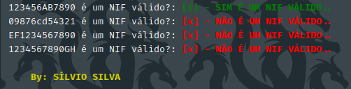
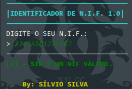

# NIF_verificator

***NÚMERO DE IDENTIFICAÇÃO FISCAL*** \
Ou como é mais conhecido \
***NUMERO DO BILHETE DE IDENTIDADE***

```txt
A Principal Finalidade deste programa é de fazer
uma verificação a fim de verificar se o seu N.I.F
é ou não Válido!
``` 

**Desfrute ao Máximo ❤️🖖👋**

## Testes e Exemplos



## Utilização
navegue ate a pasta onde esta localizada o script `NIF.py` \
e digite o seguinte no seu terminal:

Windows:
- `py NIF.py`

Linux:
- `python3 NIF.py`

**O RESULTADO DEVERÁ SER ALGO DO GÉNERO..**


